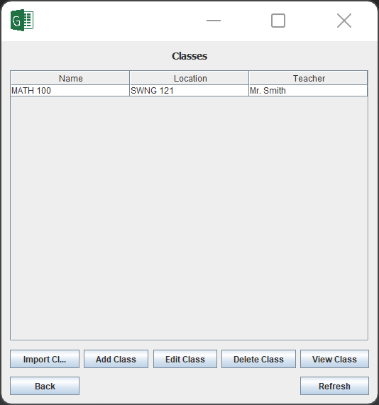
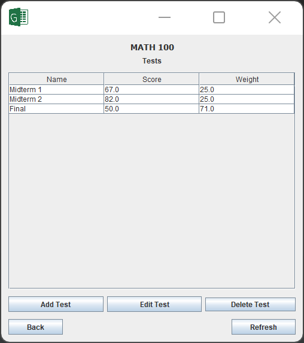
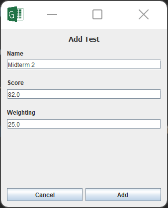
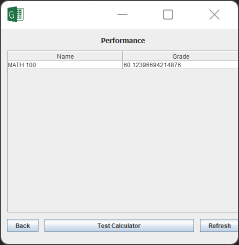

# Student Gradebook

HackED 2019 project by Michael DeMarco, Jordan Van Den Bruel, and Rajan Maghera.

## About

The aim of this project is to allow a student to track their tests by class to help monitor performance. It also emulates the feature of many popular online apps allowing users to see what grade they'd need on an assignment given the rest of their grades.

## Usage

It is runnable in IntelliJ; it was originally built in Eclipse, so it should be usable with that IDE as well. Use the pre-existing configurations to launch `StudentGradebook.java`.

## Screenshots

See the app in use below!

The homepage of the application.

The view of all classes.

The view of a given classes.

Editing a test in a given class.

A view of your net performance in all classes.
